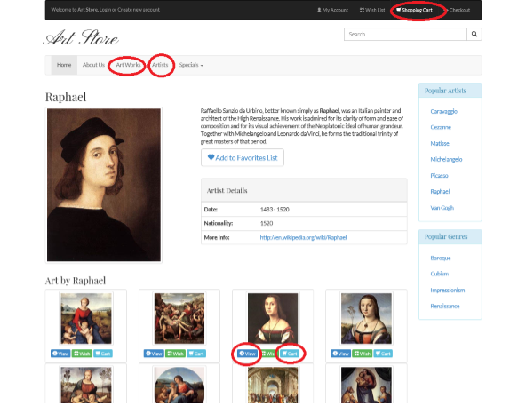
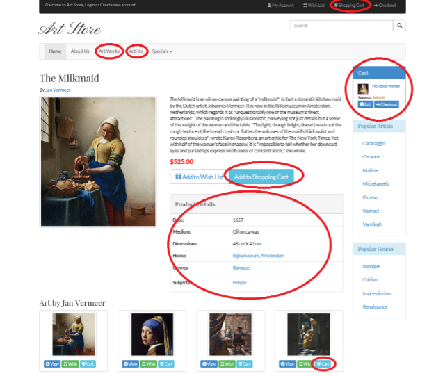

# SYSC4504
## SYSC 4504 Assignments

* ### Assignment 1 - Used HTML & CSS to develop a Form using HTML Table tags that issues post requests to http://www.randyconnolly.com/tests/process.php .
 

* ### Assignment 2 - Used HTML, CSS and JavaScript (JQuery) to display large images by clicking on the thumbnail of the small images and display the title of the images which gets dynamically updated from the thumbnail titles.
 

* ### Assignment 3 - Used HTML, PHP and Bootstrap theme to exercise server-side programming by dynamically querying the database tables to populate pages about Artists and Artworks and calculate costs of the Artworks with Session State Management to build and function shopping cart. (Need XAMPP to run!)
  
